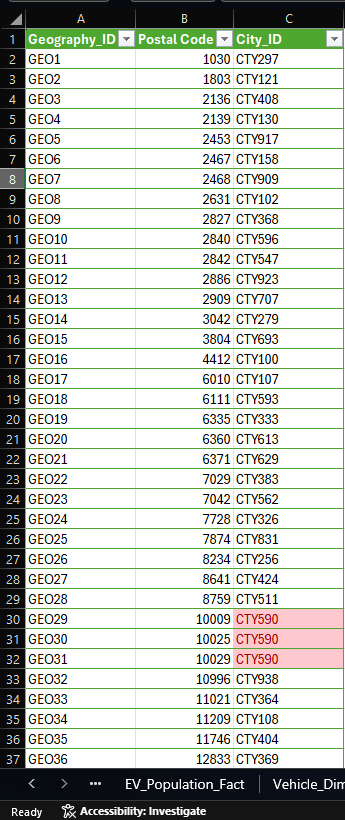
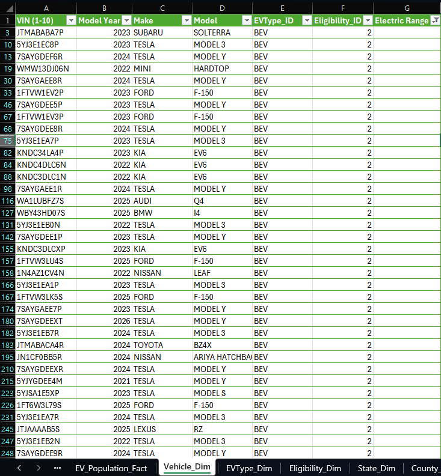
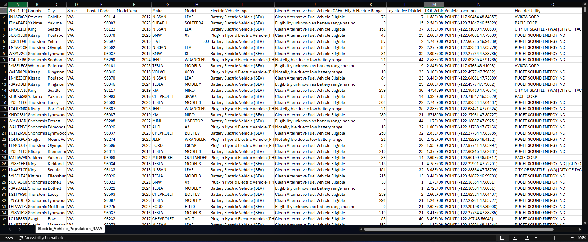
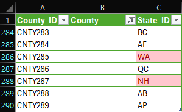
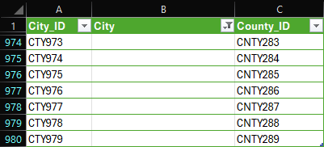
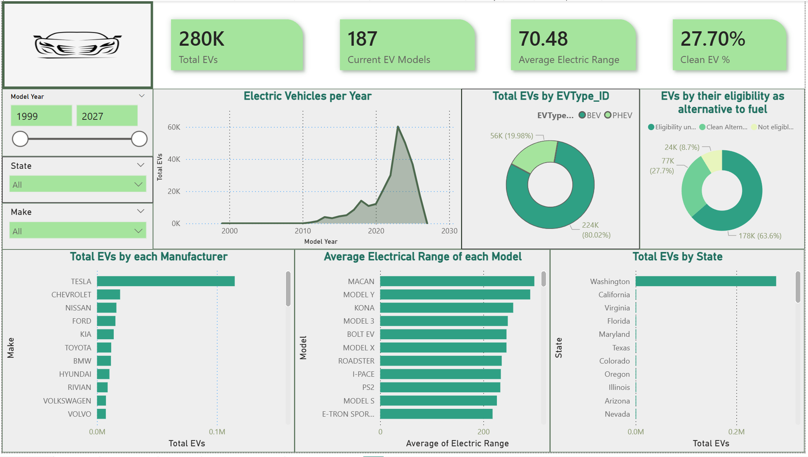
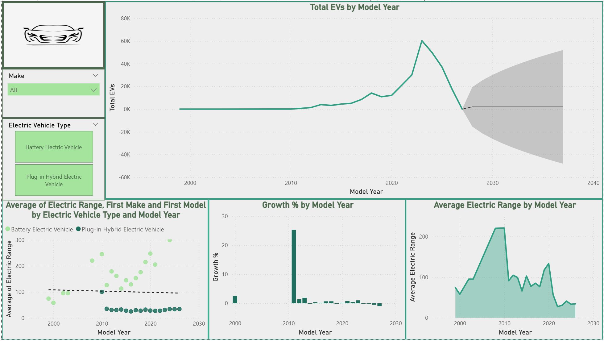

# Electric Vehicle Population Data
DATA ANALYTICS
BSCS – C301
Group 1: 
1. Gomez, Jason
2. Lopez, Justine
3. Manansala, Joshua
4. Tongol, Katriel Cire
5. Turla, Lance Amiel

DOCUMENTATION
Dataset: 
## 1. Data Preprocessing
CONCEPTUALIZE THE DATA
The raw dataset contains over 270,000 rows and 16 columns.
- Understanding first what every row represents: Each row in the CSV dataset represents an electric vehicle (EV) registered in a state within the United States of America (USA). A vehicle with a DOL ID indicates that it has been officially purchased, registered, and approved for road use.
- Understanding what each code means: Each record contains a unique Department of Licensing (DOL) ID, geographic information such as postal code, city, county, and state, as well as vehicle identification details including VIN, model year, manufacturer or brand, vehicle model, electric vehicle type, driving range, and eligibility as an alternative fuel vehicle.
- Identify whether things are qualitative or categorical values: The dataset contains geographic dimensions, vehicle specifications, and categorical eligibility types.

## Data Dictionary

### EV_Population_Fact
| Field Name | Data Type | Description | Example |
|---|---|---|---|
| `VIN (1-10)` | String | Foreign Key. First 10 characters of the Vehicle Identification Number | `JN1AZ0CP5C` |
| `Postal Code` | Float | Foreign Key. Geographic postal/ZIP code where the vehicle is registered | `99114.0` |
| `DOL Vehicle ID` | Integer | Primary Key. Unique identifier assigned to each vehicle by the Department of Licensing | `153331706` |

### EV_Dim
| Field Name | Data Type | Description | Example |
|---|---|---|---|
| `VIN (1-10)` | String | Primary Key. Partial Vehicle Identification Number | `JN1AZ0CP5C` |
| `Model Year` | Integer | Manufacturing year of the vehicle model | `2012` |
| `Make` | String | Brand or manufacturer of the vehicle | `NISSAN` |
| `Model` | String | Specific model of the vehicle | `LEAF` |
| `EVType_Code` | String | Foreign Key. Code representing the electric vehicle type | `BEV` |
| `Eligibility_Code` | Integer | Foreign Key. Code indicating alternative fuel eligibility status | `1` |
| `Electric Range` | Float | Maximum distance the vehicle can travel on a single battery charge (in miles) | `73.0` |

### EV-Type_Dim
| Field Name | Data Type | Description | Example |
|---|---|---|---|
| `EVType_Code` | String | Primary Key. Abbreviation for the EV type | `BEV` |
| `Electric Vehicle Type` | String | Full text description of the electric vehicle type | `Battery Electric Vehicle` |

### Eligibility_Dim
| Field Name | Data Type | Description | Example |
|---|---|---|---|
| `Eligibility_Code` | Integer | Primary Key. Numeric code for eligibility status | `1` |
| `Clean Alternative Fuel Vehicle Eligibility` | String | Full text description explaining whether the vehicle qualifies for clean alternative fuel vehicle incentives | `Clean Alternative Fuel Vehicle Eligible` |

### State_Dim
| Field Name | Data Type | Description | Example |
|---|---|---|---|
| `State_Code` | String | Primary Key. The 2-letter state abbreviation | `WA` |
| `State` | String | The full name of the state | `Washington` |

### County_Dim
| Field Name | Data Type | Description | Example |
|---|---|---|---|
| `County_Code` | String | Primary Key. Internal code identifying the county | `CC1`|
| `County` | String | The name of the county | `Ada` |
| `State` | String | Foreign Key. Links the county to its state | `ID` |

### City_Dim
| Field Name | Data Type | Description | Example |
|---|---|---|---|
| `City_Code` | String | Primary Key. Internal code identifying the city | `CTY1` |
| `City` | String | The name of the city | `Aberdeen` |
| `County_Code` | String | Foreign Key. Links the city to its respective county | `CC100` |

### Postal_Dim
| Field Name | Data Type | Description | Example |
|---|---|---|---|
| `Postal_Code` | Float | Primary Key. The ZIP/Postal code | `99114.0` |
| `City_Code` | String | Foreign Key. Links the postal code to its specific city | `CTY164` |

### Locate Solvable Issues

### Locate Solvable Issues

Issues found:

1. **Inconsistent Formatting:** Some postal codes were inconsistently formatted, where identical postal codes appeared both with and without leading zeros.
   * **Resolution:** Postal code values were standardized by converting them into consistent numerical representations to simplify processing and comparison.
   
   

2. **Invalid Data Entries:** The electric driving range column contained values of 0, which may indicate missing or invalid data.
   * **Resolution:** Invalid driving range values of 0 were replaced with NULL to properly represent missing or unavailable data.
   
   

3. **Data Redundancy:** The dataset contained redundant and repeated information across multiple rows.
   * **Resolution:** The dataset was normalized into fact tables and sub-dimensions to eliminate redundancy, improve consistency, and ensure that each attribute is stored in only one location.
   
   

---

### Evaluate Unsolvable Issues

1. **Missing Values:** The dataset contained missing values.
   * **Resolution:** Rather than deleting, these were kept in the sub-dimensions to maintain accurate “total count” KPIs but filtered out of map visuals to prevent errors.
   
   
   
   

AUGMENT THE DATA
•	During dataset normalization, unique identifiers were assigned to each sub-dimension to properly handle complex relationships and avoid ambiguity. This includes cases where a single postal code belongs to multiple cities, a city spans multiple counties, counties share the same name across different states, or multiple 
counties exist within a single state. 
•	Lookup operations were performed to retrieve and integrate related data from other normalized tables, improving data consistency, relationship mapping, and overall referential integrity.

NOTE AND DOCUMENT
The dataset was cleaned and normalized using the CLEAN framework and structured following a Snowflake schema design. This approach was used to efficiently manage complex relationships among geographic attributes such as postal codes, cities, counties, and states, as well as vehicle-related attributes including VIN numbers, vehicle models, manufacturers, and other related details. The normalization process reduced data redundancy, improved consistency, and strengthened referential integrity across the database.

# 2. Exploratory Data Analysis (EDA)

KPI's and Measures:
1.	Clean EV% - Measure to show the percentage of clean Electric vehicles used in combination with slicers for manufacturers and models to see how much of the EVs produced by them are clean fuel alternatives
```dax
Clean EV % = DIVIDE(CALCULATE(COUNTROWS('EV_Fact'), Vehicle_Dim[Eligibility_ID]= 1), COUNTROWS('EV_Fact'))
```
2.	Total EVs – Measure to count the total amount of registered EVs, used to see how many EVs there are and combined with slicer to more specifically see how much of a certain model or a certain manufacturers amount of EVs.
```dax
Total EVs = CALCULATE(COUNTROWS('EV_Fact')) 
```
3.	Average Electric Range – Measure for getting the average electric range of the EVs, used mainly to show the current general average range of EVs but with slicers it can used to show the average range of certain models or certain manufacturers’ vehicles
```dax
Average Electric Range = CALCULATE(AVERAGE(Vehicle_Dim[Electric Range]))
```
4.	Current EV Models – shows the total number of EV models, can be used with the manufacturer slicer to see the amount of models from a manufacturer.
```dax
Current EV Models = CALCULATE(DISTINCTCOUNT(Vehicle_Dim[Model]))
```
5.	Distinct Model per Year -shows the amount of models made/released in a year, in this case its used to show how if a model is being made or being released in that year since usually its just 1 of the model per year
```dax
Distinct Models per Year = DISTINCTCOUNT(Vehicle_Dim[Model Year])
```
6.	Electrical Range Spread – shows the difference between the vehicle with the highest electrical range and the vehicle with the lowest electrical range, used with slicers to specify the spread of range either per model or base on all the models of a manufacturer.
```dax
Electrical Range Spread = MAX(Vehicle_Dim[Electric Range]) - MIN(Vehicle_Dim[Electric Range])
```
7.	EV Manufacturers- used to count how many EV manufacturers there are, used with a year slicer to see how many manufacturers there are per year.
```dax
EV Manufacturers = DISTINCTCOUNT(Vehicle_Dim[Make])
```
8.	Growth % - used to show how much more or less EVs there are compared to the last year, can be used again with slicers
```dax
Growth % = DIVIDE([Model Growth], [Previous Year Models])
```
9.	Model Growth – used by the above measure to calculate the difference between the current and last year’s amount of EVs
```dax
Model Growth = [Total EVs] - [Previous Year Models]
```
10.	Previous Year Model – used to calculate the models of the last year, used mainly in the Growth % measure.
```dax
Previous Year Models = CALCULATE([Total EVs], FILTER(ALL('Vehicle_Dim'),'Vehicle_Dim'[Model Year] = MAX('Vehicle_Dim'[Model Year]) - 1))
```
11.	Max Electric Range – used to show the highest range a model has.
```dax
Max Electric Range = MAX(Vehicle_Dim[Electric Range])
```
12.	Min Electric Range – used to show the lowest range a model has.
```dax
Min Electric Range = MIN(Vehicle_Dim[Electric Range])
```

# 3. Data Modeling Analytics
The dataset was cleaned and normalized using the CLEAN framework and structured following a Snowflake schema design.  
<image src="DataModel.png">

## Snowflake Schema Implementation
This approach was used to efficiently manage complex relationships among geographic attributes such as postal codes, cities, counties, and states, as well as vehicle-related attributes including VIN numbers, vehicle models, manufacturers, and other related details. The normalization process reduced data redundancy, improved consistency, and strengthened referential integrity across the database.  
By separating entities into EV_Population_Fact, EV_Dim, and hierarchical location tables (Postal_Dim -> City_Dim -> County_Dim -> State_Dim), the model optimizes query performance and allows for accurate aggregation without counting duplicate text values.  

## Descriptive and Predictive Analytics
The study utilized a combination of descriptive and predictive analytics to provide a comprehensive view of the electric vehicle (EV) market. The objective was not only to understand historical adoption patterns but also to forecast future growth.

**Descriptive Analytics** was used to analyze, summarize, and present the existing EV population data.

* **Focus:** Identifying trends, distributions, frequencies, and relationships among variables such as geographic location (State, County, Postal Code), vehicle manufacturer (Make/Model), electric range, and EV type (BEV vs. PHEV).
* **Questions Answered:** "What happened?", "What is the current state of the EV market?", and "Where are the existing EV adoption hotspots?"
* **Application:** The team used statistical summaries, Power BI visualizations, KPIs, and measures such as Total EVs Registered, Average Electric Range, and BEV vs. PHEV Proportion based on historical Department of Licensing (DOL) records.

**Predictive Analytics** was applied to project future market behavior and anticipate infrastructure needs based on historical data trends.

* **Focus:** Forecasting the future volume of electric vehicles entering the market and evaluating potential market acceleration or saturation.
* **Questions Answered:** "What will happen next?" and "At what rate will EV adoption continue to grow?"
* **Application:** The study involved forecasting techniques—specifically utilizing Power BI's built-in exponential smoothing algorithms. This generated predictive models like the Primary Volume Predictor, which uses trend lines and 95% statistical confidence intervals to illustrate best-case (rapid adoption) and worst-case (market disruption) future scenarios.

# 4. Visualization and Dashboard

The dashboard design follows the **DASH** framework:

* **D — Decision:** Enables policymakers, infrastructure planners, and auto manufacturers to see where EV adoption is highest, determining where to build charging stations or target market incentives.
* **A — Audience:** Targeted at **Government Transportation Officials** and **Infrastructure Planners** who need both high-level geographic breakdowns and granular vehicle performance metrics.
* **S — Signal:** Emphasizes key signals like Total Registered EVs, BEV vs. PHEV distributions, and the Average Electric Range, immediately highlighting the current state of EV technology adoption.
* **H — Hierarchy:** The dashboard flows from high-level geographic adoption maps and total counts, drilling down into manufacturer dominance (Make/Model), and finally evaluating clean-energy eligibility and electric range limits.

### Descriptive Analytics Dashboard



### Predictive Analytics Dashboard



---

# 5. Insights and Recommendations
